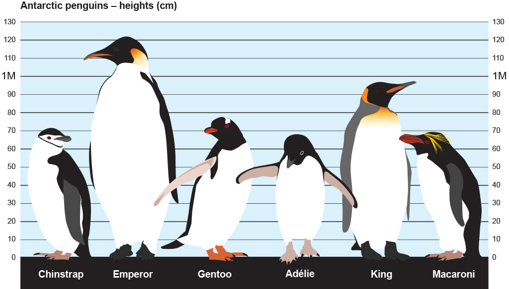

```{r setup, include=FALSE}
knitr::opts_chunk$set(echo = TRUE)
library(tidyverse)
library(car) # Just use for the Type III ANOVA check here
library(janitor)
library(ggbeeswarm)
library(kableExtra)
```

In lectures during week 8, we'll learning about:

- Comparisons of means between > 2 groups by one-way Analysis of Variance (ANOVA) with post-hoc Tukey's HSD
- Chi-square test for independence (comparing proportions across groups)

### Lab 8 Objectives: 

- Compare mean across > 2 groups by one-way ANOVA (`aov`)
- Perform post-hoc Tukey's HSD (`TukeyHSD`)
- Create a ggplot2 graph with error bars
- Chi-square test for association with `chisq.test()`
- Make a table of proportions with `janitor::adorn_*` + `kable`

### One-way ANOVA

We'll be comparing sizes for three penguin species (Gentoo, Chinstrap and Adelie) collected by researchers at [Palmer Station LTER, Antarctica](https://pal.lternet.edu/).

Illustrated comparison from the [British Antarctic Survey](https://www.bas.ac.uk/about/antarctica/wildlife/penguins/): 


### 1. Read in the *penguins.csv* dataset

```{r}
penguins <- readr::read_csv("penguins.csv") %>% 
  janitor::clean_names()
```

### 2. Make a table of counts by species and sex

```{r}
penguin_counts <- penguins %>% 
  count(species, sex)

penguin_counts
```

We ask: Is there a significant difference in mean flipper length (mm) between the three species for **female** penguins?

- Null hypothesis: There is no significant difference in mean flipper length between the three groups

- Alternative hypothesis: There **is** a significant difference in mean flipper length between the three groups

### 3. First, look at the distributions for female penguin flipper lengths

```{r}
penguin_f <- penguins %>% 
  filter(sex == "FEMALE")

# Faceted histograms: 
ggplot(data = penguin_f, aes(x = flipper_length_mm)) +
  geom_histogram(aes(fill = species),
                 alpha = 0.5,
                 show.legend = FALSE,
                 bins = 15) +
  facet_wrap(~species, scales = "free")

# Faceted QQ plots: 
ggplot(data = penguin_f, aes(sample = flipper_length_mm)) +
  geom_qq(aes(color = species),
                 alpha = 0.5,
                 show.legend = FALSE
          ) +
  facet_wrap(~species, scales = "free")

# These look pretty darn normal. Let's see what their means, sds, se, and variances are: 

```

### 4. Find summary statistics, check for equal variances

```{r}
penguin_f_summary <- penguin_f %>% 
  group_by(species) %>% 
  summarize(
    mean_flipper_length = mean(flipper_length_mm),
    sd_flipper_length = sd(flipper_length_mm),
    sample_size = n(),
    se_flipper_length = sd(flipper_length_mm) / sqrt(n()),
    var_flipper_length = var(flipper_length_mm)
  )

penguin_f_summary

# Importantly, variances are pretty close (largest is < 4x greater than the smallest)
# But we can perform a Levene's Test for equal variances anyway: 

leveneTest(flipper_length_mm ~ species, data = penguin_f) # Not significant (we retain the null hypothesis of equal variances)

```

### 5. Make a plot of data with mean and SE indicated: 

```{r}

ggplot() +
  geom_beeswarm(data = penguin_f, 
                aes(x = species, 
                    y = flipper_length_mm,
                    ),
                size = 3,
                alpha = 0.6,
                pch = 16,
                color = "gray70") +
  scale_x_discrete(labels = c("Adelie", "Chinstrap", "Gentoo")) +
  geom_point(data = penguin_f_summary, aes(x = species, y = mean_flipper_length), 
             color = "firebrick",
             size = 4) +
  geom_errorbar(data = penguin_f_summary, 
                aes(x = species, 
                    ymin = mean_flipper_length - sd_flipper_length,
                    ymax = mean_flipper_length + sd_flipper_length),
                color = "firebrick",
                width = 0.1) +
  theme_light()

```

### 6. One-way ANOVA

Use `aov()` for one-way (single factor) ANOVA in R:

```{r}

penguin_aov <- aov(flipper_length_mm ~ species, data = penguin_f)
summary(penguin_aov)

# We retain the alternative hypothesis (mean flipper lengths for the 3 species are NOT the same). But are they all different from each other? Or just two? 

```

##### Additional: comparing to Type III ANOVA

```{r}

penguin_lm <- lm(flipper_length_mm ~ species, data = penguin_f)
penguin_aov_t3 <- Anova(penguin_lm)
penguin_aov_t3

# Notice that the F statistic value here (411.79) is almost exactly the same - the difference between these two is minimal. 
```


### 7. Post-hoc Tukey's HSD

```{r}
TukeyHSD(penguin_aov)

# Conclusion: means for ALL pairwise combinations are significantly different
```

Conclusion: Mean flipper lengths differed significantly between Chinstrap (mean +/- se), Gentoo (mean +/- se), and Adelie (mean +/- se) penguins (one-way ANOVA with post-hoc Tukey's HSD, F(df) = ??, *p* < 0.05). 

### 8. Chi-Square test for independence

Chi-square is a test for associations between two or more nominal (categorical variables), usually comparing counts within groups across levels. 

What we're really asking: are the proportions within different levels in a group so different *across* multiple groups that we actually think there's an effect of *group*? 

**Null hypothesis**: There is no significant association between Variable A and Variable B (or, Variables A and B are independent)

**Alternative hypothesis**: There IS a significant association between Variable A and Variable B (or, Variables A and B are NOT independent)

Explore the `gss_cat` built-in dataset from forcats package (sample from the General Social survey, 2000 - 2014): `View(gss_cat)`

First, let's filter this a bit: 

- only include 'relig' == "None" or "Christian"
- only include 'marital' == "Never married" or "Married" or "Divorced"

We'll ask: Is there a significant difference in religious alignment (limiting here to "None" or "Christian" for simplicity) for "Strong republican" vs. "Strong democrat" voters?

First, filter then get a table of counts & proportions: 
```{r}

# Get the counts:
party_relig <- gss_cat %>% 
  filter(partyid %in% c("Strong republican", "Strong democrat")) %>% 
  filter(relig %in% c("None", "Catholic")) %>% 
  count(partyid, relig)

# Put it into wide format (contingency table):
party_relig_table <- party_relig %>% 
  pivot_wider(names_from = relig, values_from = n)

```


#### Make a nice table with proportions using janitor::adorn_*

Once again, `janitor` just being totally awesome: 

```{r}
party_relig_props <- party_relig_table %>% 
  janitor::adorn_percentages(denominator = "row") %>% 
  adorn_pct_formatting(digits = 0) %>% 
  adorn_ns(position = "front")

party_relig_props <- party_relig_props %>% 
  rename(Affiliation = partyid)

party_relig_props
```

A nicer version of this table: 
```{r}
kable(party_relig_props) %>% 
  kable_styling()
```

Whoooaaaa thanks again, `janitor`!!!

Now, we'll ask: Are political and religious affiliation independent? 

#### Chi-square test for independence

A. First, get just a contingency table of counts we just want the four count values in a df, nothing else: 
```{r}
chi_counts <- party_relig_table %>% 
  select(-partyid)

chi_counts
```

B. Run a chi-square test for independence using `chisq.test()`:

```{r}
my_party_chi <- chisq.test(chi_counts)

my_party_chi
```

Result: Party and religious affiliation are NOT independent. 

Another way of saying that: There is a significant difference in religious affiliation (none or Catholic) for Strong Republicans and Strong Democrats. 

Another way of saying that: There is a significant association between party and religious affiliation for the levels studied. 

#### Let's do another example with independents and strong democrats: 

```{r}
# Get the counts:
party_relig_2 <- gss_cat %>% 
  filter(partyid %in% c("Independent", "Strong democrat")) %>% 
  filter(relig %in% c("None", "Catholic")) %>% 
  count(partyid, relig)

# Put it into wide format (contingency table):
party_relig_table_2 <- party_relig_2 %>% 
  pivot_wider(names_from = relig, values_from = n)

party_relig_props_2 <- party_relig_table_2 %>% 
  janitor::adorn_percentages(denominator = "row") %>% 
  adorn_pct_formatting(digits = 0) %>% 
  adorn_ns(position = "front")

party_relig_props_2 <- party_relig_props_2 %>% 
  rename(Affiliation = partyid)

party_relig_props_2
```

Are these significantly different? They look pretty close. Are they different enough (given the large sample sizes) to detect a significant difference? 

```{r}
chi_counts_2 <- party_relig_table_2 %>% 
  select(-partyid)

chi_counts_2

# Run chi-square:
chisq.test(chi_counts_2) # Still significantly different, but it's important to show the ACTUAL PROPORTIONS, which are pretty close!!! 
```

### END LAB
