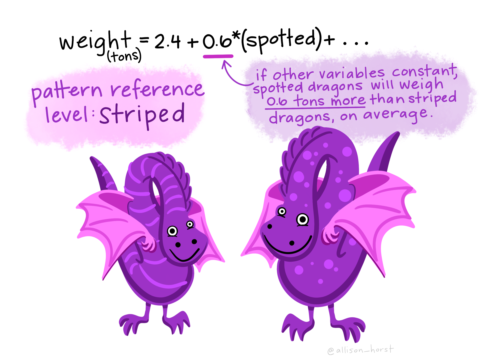
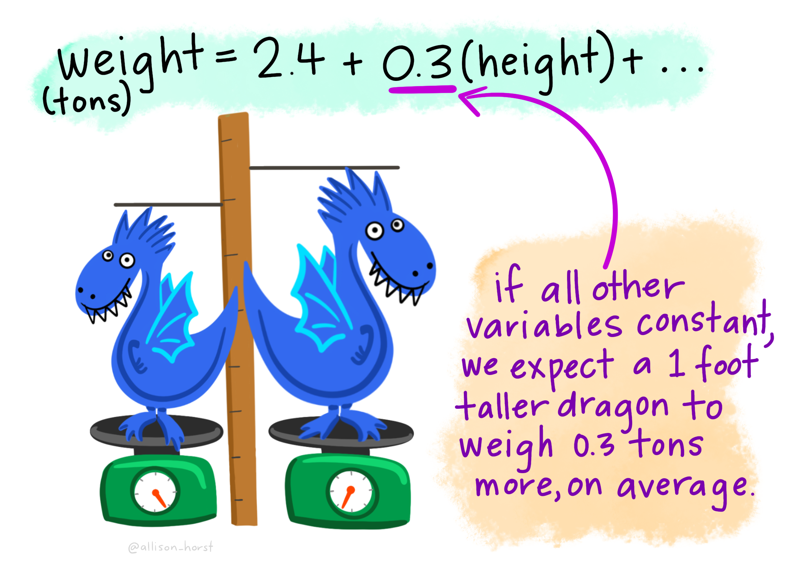
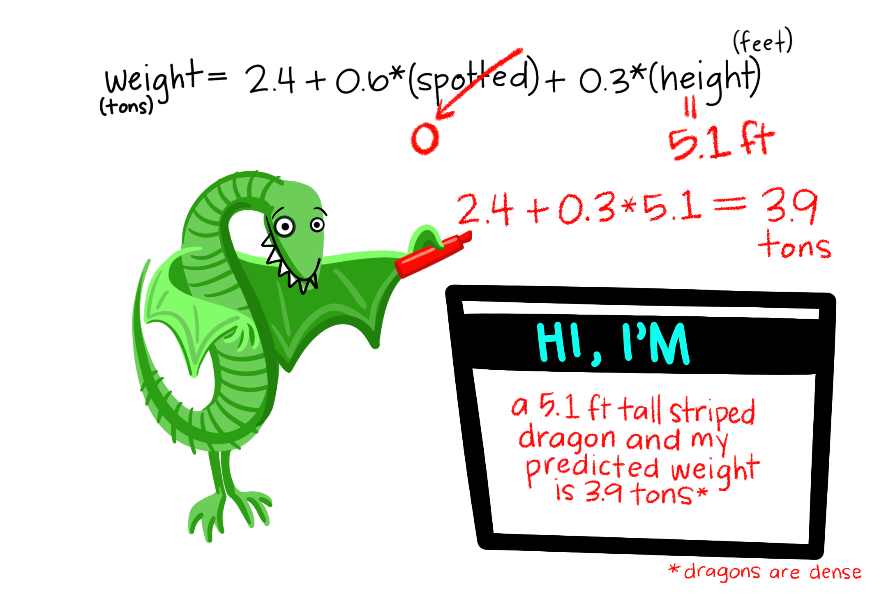
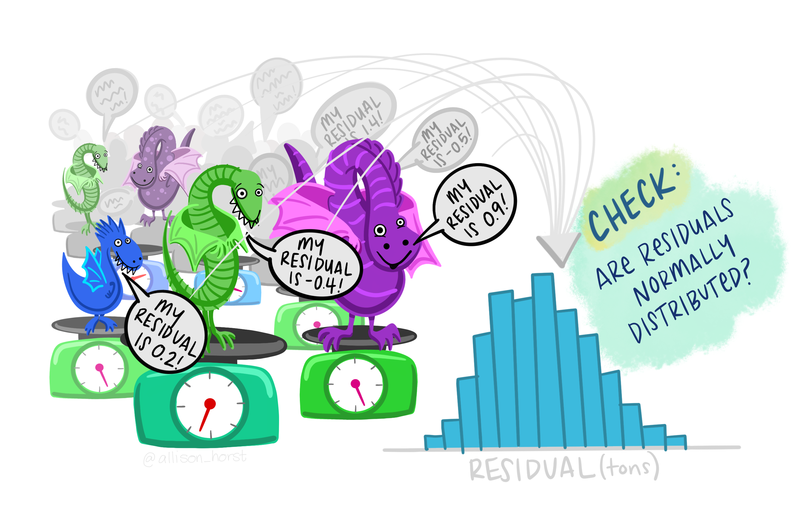

```{r setup, include=FALSE}
knitr::opts_chunk$set(echo = FALSE, message = FALSE, warning = FALSE)
library(tidyverse)
library(ggpubr)
library(kableExtra)
```

#### Some things

- You are expected to read through and understand this document, and complete the practice questions at the end (even though you won't submit anything associated with this document) in place of an in-class lecture on Wednesday 11/27/2019
- You should read and understand the materials in this document *before* attempting the Week 9 Quiz
<br>
<br>

### 1. Introduction

In previous lectures, we learned about simple linear regression by ordinary least squares to explore relationships between two continuous quantitative variables: $y = \beta_{0} + \beta_{1}x + \epsilon$

Where: 

- $y$ is the expected value of the dependent (outcome) variable
- $\beta_{0}$ is the $y$-intercept
- $\beta_{1}$ is the slope (coefficient) associated with variable $x$
- $\epsilon$ is the error term

For example, we may want to explore the relationship between dragon age (x) and dragon weight (y): 

```{r, fig.width = 5, fig.height = 5}

dragon_df <- tribble(
  ~dragon_age, ~dragon_wt,
  0, 0.1,
  1, 0.2,
  2, 0.8,
  3, 0.9,
  4, 1.4,
  5, 1.6,
  6, 1.3,
  7, 2.5,
  8, 2.4,
  9, 2.8,
  10, 3.2
)

ggplot(data = dragon_df, aes(x = dragon_age, y = dragon_wt)) +
  geom_point(size = 3,
             color = "gray50") +
  geom_smooth(method = "lm",
              se = FALSE,
              size = 0.5,
              color = "black") +
  scale_x_continuous(breaks = seq(0,10)) +
  scale_y_continuous() +
  theme_light() +
  theme(panel.grid = element_blank()) +
  labs(x = "Dragon age (years)",
       y = "Dragon weight (tons)") +
  stat_cor(label.x = 6, label.y = 0.4) +
  stat_regline_equation(label.x = 6, label.y = 0.6)

```


In the example above, we'd use linear regression to understand the relationship between one continuous variable **dragon age** and one continuous variable **dragon weight**, and can interpret the slope as follows: 

- *"For each 1 year increase in dragon age, we expect dragon weight to increase on average by 0.31 tons."*

In that example, we could consider **dragon age** as a single *predictor variable*, and **dragon weight** as a single continuous *outcome variable*. But often, we don't just have a single predictor variable that influences a single continuous outcome variable - we can imagine that the outcome variable **dragon weight** might be influenced by a number of variables, like: age, species, and diet. 

>>When we are trying to explore relationships between **multiple predictor variables** (continuous or categorical) and a **single continuous outcome variable**, we might use *multiple linear regression.*

In this lesson, we'll learn first how to use and interpret variable coefficients from multiple regression models, then learn about model assumptions. The next lecture will cover statistics, concerns & pitfalls. 
<br>
<br>

### 2. Meet multiple linear regression

Multiple linear regression extends the simple linear regression equation to include > 1 predictor variables (continuous or categorical): 

$$y = \beta_{0} + \beta_{1}x_{1} + \beta_{2}x_{2} + ... + \beta_{n}x_{n} + \epsilon$$

Where: 

- $y$ is the expected value of the dependent (outcome) variable
- $\beta_{0}$ is the $y$-intercept
- $\beta_{n}$ are coefficients for the various predictor variables, $x_{n}$
- $\epsilon$ is the error term
<br>
<br>

### 3. Multiple linear regression with continuous predictor variables

Let's first consider multiple linear regression with one continuous outcome variable (**dragon weight**) and > 1 continuous predictor variables (**dragon age** in years, and **dragon diet**, a continuous measure of daily food intake in pounds). First, we'll think about what that equation could look like and how to interpret it. 

Here's some data (stored as object **dragon_df_2**):  
```{r}
dragon_df_2 <- tribble(
  ~dragon_age, ~dragon_diet, ~dragon_wt, 
  0, 20.2, 0.1,
  1, 30.6, 0.2,
  2, 40.2, 0.8,
  3, 31.6, 0.9,
  4, 19.2, 1.4,
  5, 45.6, 1.6,
  6, 26.1, 1.3,
  7, 20.4, 2.5,
  8, 31.8, 2.4,
  9, 50.4, 2.8,
  10, 28.6, 3.2
)

kable(dragon_df_2) %>% 
  kable_styling(full_width = FALSE)
```

Running multiple linear regression in R as follows:
```{r, echo = TRUE}
dragon_mlr <- lm(dragon_wt ~ dragon_age + dragon_diet, data = dragon_df_2)
```

Yields the following: 
```{r}
dragon_mlr
```

Written as an equation, expected dragon weight (as a function of age and diet) is modeled as follows: 

> weight(age, diet) = `r round(dragon_mlr$coefficient[1],4)` + `r round(dragon_mlr$coefficient[2],4)`\*(age) -`r -round(dragon_mlr$coefficient[3],4)`\*(diet)

And we could use that equation to find the *expected* dragon weight (tons) for dragons of different age and diet. 

**Example**: Based on our model, what weight would we expect for a dragon that is 8.5 years old and eats 45 pounds of food per day? 

> weight(8.5, 45) = `r round(dragon_mlr$coefficient[1],4)` + `r round(dragon_mlr$coefficient[2],4)`\*(8.5) -`r -round(dragon_mlr$coefficient[3],4)`\*(45) = `r round(predict(dragon_mlr, newdata = data.frame(dragon_age = 8.5, dragon_diet = 45)), 4)` tons

**Example**: Based on our model, what weight would we expect for a dragon that is 2.2 years old and eats 18.3 pounds of food per day?

> weight(2.2, 18.3) = `r round(dragon_mlr$coefficient[1],4)` + `r round(dragon_mlr$coefficient[2],4)`\*(2.2) -`r -round(dragon_mlr$coefficient[3],4)`\*(18.3) = `r round(predict(dragon_mlr, newdata = data.frame(dragon_age = 2.2, dragon_diet = 18.3)), 4)` tons

#### Interpreting coefficients for continuous predictor variables

In the examples above, we entered values for the two continuous predictor variables (age and diet) to find an expected value of dragon weight. How do we **interpret** the individual coefficients associated with each of the predictor variables? 

Coefficients for continuous predictor variables in multiple linear regression can be interpreted as *the expected change in value of the outcome variable with each 1-unit increase in the predictor variable, **if everything else is held constant**.*

Let's interpret the two coefficients from the model above: 

- **For each one year increase in dragon age we expect dragon weight to increase by `r round(dragon_mlr$coefficient[2],4)` tons on average, if dragon diet is held constant.** Another way to think about this: If we have two dragons that eat the same daily amount (diet is constant) but are separated in age by one year, then we'd expect the older dragon to weigh `r round(dragon_mlr$coefficient[2],4)` tons more than the younder dragon, on average.

- **For each one pound increase in dragon daily diet we expect dragon weight to decrease by `r -round(dragon_mlr$coefficient[3],4)` tons, if dragon age is held constant.** Another way to think about this: If we have two dragons that are the same exact age, if Dragon A eats one pound of food more daily than Dragon B, we'd expect Dragon A to weigh `r -round(dragon_mlr$coefficient[3],4)` tons LESS than Dragon B, on average. 
<br>
<br>

### 4. Multiple linear regression with categorical predictor variables

The two predictor variables considered in the example above (age and diet) are continuous variables. But we can imagine that there might be some categorical variables that can influence dragon weight, like dragon species. 

Let's consider a scenario in which we have now have three predictor variables: 

- **Dragon diet (daily pounds consumed)** - a continuous quantitative variable
- **Dragon age (years)** - a continuous quantitative variable
- **Dragon species (Friendlygreen, Miniblue, or Giantpurple)** - a categorical variable with three levels


How can we include this categorical **species** variable to consider how dragon species is related to dragon weight? 

To understand how those can be included, we need to understand a couple of things first: **dummy variables** and **reference levels**. 
<br>

#### **Dummy variables**

In order for a categorical variable to be included in a model - which is what we're creating, when we do multiple linear regression - we need to convert the variable levels (in this case, dragon species) into a terms that are compatible with math (e.g., numeric information). 

We do that using **dummy variables**, also called **indicator variables**, which convert categorical levels into numeric variables. 

Dummy variables are coded with zeroes and ones. With three levels, we could manually code the levels as follows: 

- Friendlygreen = [0  0]
- Miniblue =      [1  0]
- Giantpurple =   [0  1]

The level that is coded as only zeroes, in this case *Friendlygreen   [0  0]*, is called the "reference level" - and can be considered the "baseline level" that the regression model is created for. What does that mean? To better understand, let's consider an example model with the **species** categorical predictor variable included. 
<br>

#### **Interpreting coefficients for categorical predictor variables**

**Example:** We decide that multiple linear regression is an appropriate type of analysis to explore relationships between **dragon weight** (a continuous outcome variable) and the three predictor variables described above:  

- **Dragon diet (daily pounds consumed)** - a continuous quantitative variable
- **Dragon age (years)** - a continuous quantitative variable
- **Dragon species (Friendlygreen, Miniblue, or Giantpurple)** - a categorical variable with three levels

Running multiple linear regression, we find the following regression equation: 

> weight(age, diet, species) = 0.41 + 0.283\*(age) + 0.019\*(diet) - 0.056\*(Miniblue) + 0.077\*(Giantpurple)

A couple things to notice in the model above: 

- The **age** and **diet** variables show up as expected
- We don't see an overall **species** variable, instead we see two levels (Miniblue and Giantpurple) appear separately
- The Friendlygreen species level doesn't show up at all

What does it mean that the Friendlygreen species level doesn't appear? That means Friendlygreen is the *reference level* and has been coded as [0   0], and the coefficients for the species levels that **do** appear in the model (-0.056\*Miniblue and +0.77\*Giantpurple) tell us something about the expected dragon weight *compared to a reference species of Friendlygreen*. 

Let's break down the interpretation of each coefficient: 

- **0.283\*(age)**: If everything else is held constant, we would expect a 0.283 ton increase in dragon weight for each one year increase in dragon age. 

- **0.019\*(diet)**: If everything else is held constant, we would expect a 0.019 ton increase in dragon weight for each addition 1 pound in dragon daily food intake. 

- **-0.056\*(Miniblue)**: If everything else about the dragons is the same (age, diet), we would expect a Miniblue dragon to weigh 0.056 tons *less* than a Friendlygreen dragon on average.

- **0.77\*(Giantpurple)**: If everything else about the dragons is the same (age, diet), we would expect a Giantpurple dragon to weight 0.77 tons *more* than a Friendlygreen dragon on average. 

So we see that the coefficients for the non-reference levels of the *species* variable tell us how we expect the outcome variable (dragon weight) to differ from the *reference level* of species. 
<br>

#### **Making predictions for a model with categorical predictor variables**

To calculate the estimated value of the outcome variable (here, dragon weight) when the model contains a categorical variable, set the categorical level of interest to 1 and all other levels of the categorical variable to 0. To predict a value for the *reference level*, set all non-reference levels that appear in the model to zero. 

For the following examples, we'll use the regression model from above: 

> weight(age, diet, species) = 0.41 + 0.283\*(age) + 0.019\*(diet) - 0.056\*(Miniblue) + 0.077\*(Giantpurple)

**Example**: What weight would we expect for a Miniblue dragon that is 5.7 years old and eats 25.1 pounds of food daily? 

- Enter '1' for Miniblue, and '0' for Giantpurple
- Enter the values for the continuous variables (age & diet) as previously

> weight(5.7, 25.1, Miniblue) = 0.41 + 0.283\*5.7 + 0.019\*(25.1) - 0.056\*(1) + 0.077\*(0) = 2.44 tons

**Example**: What weight would we expect for a Giantpurple dragon that is 2.1 years old and eats 15.6 pounds of food daily? 

- Enter '1' for Giantpurple, and '0' for Miniblue
- Enter the values for the continuous variables (age & diet) as previously

> weight(2.1, 15.6, Giantpurple) = 0.41 + 0.283\*2.1 + 0.019\*(15.6) - 0.056\*(0) + 0.077\*(1) = 1.38 tons

**Example**: What weight would we expect for a Friendlygreen dragon that is 7.4 years old and eats 30.4 pounds of food daily? 

- Enter '0' for both Miniblue and Giantpurple (what remains is an equation for the reference level)
- Enter the values for the continuous variables (age & diet) as previously

> weight(7.4, 30.4, Friendlygreen) = 0.41 + 0.283\*7.4 + 0.019\*(30.4) - 0.056\*(0) + 0.077\*(0) =  3.08 tons

**NOTICE:** Categorical predictors must have levels that are mutually exclusive (e.g. a dragon can EITHER be Friendlygreen, Miniblue, or Giantpurple). We don't assign fractions of combinations - the levels are assigned *either* a 0 **or** 1, depending on which level you want to evaluate for. 
<br>
<br>

#### **Another example: dragon weight as a function of pattern and height**

For another dataset, dragon weight (tons) is modeled as a function of dragon height (feet) and pattern (striped / spotted) by multiple linear regression: 

> **weight = 2.4 + 0.6\*(spotted) + 0.3\*(height)**
    
**A. What are the predictor and outcome variable(s), and what type of variable are they?**

- Predictor: pattern, a categorical variable (striped = reference level)
- Predictor: height (ft), a continuous variable
- Outcome: weight (tons), a continuous variable

**B. Interpret the 0.6 coefficient for *spotted*:**

> If dragons were otherwise the same, we would expect a **spotted dragon** to weight 0.6 tons more than a **striped dragon** (the reference level), on average!



**C. Interpret the 0.3 coefficient for **height**:**

> If dragons are otherwise the same, we expect **dragon weight to increase by 0.3 tons for every 1 foot increase in dragon height**, on average. 



**D. Using that model (weight = 2.4 + 0.6\*(spotted) + 0.3\*(height)), what is the predicted weight of a spotted dragon that is 6.8 feet tall?** 

> **weight(spotted, 6.8) = 2.4 + 0.6\*(1) + 0.3\*(6.8) = 5.0 tons**
    
**E. Using that model, what is the predicted weight of a *striped* dragon that is 5.1 feet tall?**

> **weight(striped, 5.1) = 2.4 + 0.6\*(0) + 0.3\*(5.1) = 3.9 tons**
    


**F. If the *actual* weight of a dragon predicted in (E) is 4.2 tons, what is the *residual* (error)?**

> Residual (e) = $y_{actual}$ - $y_{predicted}$ = 4.2 - 3.9 = 0.3 tons


    
### 5. Assumptions in multiple linear regression

Multiple linear regression may be the **most often used and seen type of regression** in environmental science. While it is widely applicable and useful, there are assumptions that should be considered: 

- Outcome & predictor variables are linearly related 
- Residuals normality
- Homoscedasticity (constant residuals variance)
- Residuals are independent

Those should sound familiar, since we've considered the same assumptions for several other analyses we've done (including simple linear regression). 

**Note**: We will see how to use diagnostic plots for multiple linear regression to explore assumptions in Labs 9 and 10, so this is only a brief overview & will be covered in more depth next week.

There is also a nice summary of multiple linear regression assumptions from Dr. Robert Nau at Duke, which you can [read here](http://people.duke.edu/~rnau/testing.htm). 
<br>
<br>

##### **Assumption A. Outcome variable & predictor variables are linearly related**

    **Summary**: Since the relationships expressed in a multiple linear regression model are linear relationships between the outcome variable and the different predictor variables, we should visually explore the pairwise relationships. 

    - Explore scatterplots between the outcome variable and each predictor variable
    - Explore observed vs. predicted values
    - Explore residuals
    - Specifically look for any trends that look notably *non-linear* (e.g. curvilinear)

   **Note**: the linearity assumption for dummy variable-coded predictor variables is auto-satisfied, so this only applies for the relationship between continuous predictors and the outcome variable. 

    **Risk**: If relationships are non-linear, predictions (especially extrapolated) can be very wrong, and coefficients cannot be meaningfully interpreted

    **Possible solution if violated**: Variable transformation
<br>
<br>

##### **Assumption B: Multivariate normality of residuals**

    **Summary**: When we look at how different our model predicted values are from the actual values (residuals), are those residuals normally distributed? 

    - Explore histograms & quantile-quantile plots of residuals



    **Risk**: If residuals are not normally distributed, parameter (coefficient estimates) can be skewed and confidence intervals may be over- or underestimated. 
<br>
<br>

##### **Assumption C: Homoscedasticity**

    **Summary**: Variance of residuals are approximately constant 

    - See diagnostic plot of residuals & standardized residuals to visually assess variance

    **Risk**: Poor estimate of uncertainty / error

##### **Assumption D: Errors are independent (no correlation of residuals)**

    **Summary**: Errors should be uncorrelated (e.g. the residual associated with one prediction should not affect or be affected by any other residuals)
    
    Can be a large concern w/ time-series data (non-independence)
<br>
<br>

### 6. Practice questions

**You should complete these and check solutions (below) prior to attempting the timed quiz on GauchoSpace.**

A researcher is investigating the impacts of stream water temperature ($^{\circ}$C), volumetric flow rate (cubic feet per second, cfs), and substrate composition (gravel, sand, or mud) on chlorophyll concentration ($\mu$g/L). After thoroughly exploring and thinking really hard about the data, they determine that multiple linear regression is an appropriate approach to explore relationships between variables. 

Performing multiple linear regression in R, they find the following model: 

> chlorophyll = 19.2 + 1.3\*(temperature) - 0.04\*(flow_rate) - 8.6\*(gravel) - 5.1\*(sand)

**A. What are the predictor and outcome variables, and what type of variable is each?**

**B. What is the *reference level* for stream substrate composition?**

**C. Interpret each of the model coefficients.**

i. Write a sentence describing what the 1.3 coefficient for *temperature* means
ii. Write a sentence describing what the -0.04 coefficient for *flow_rate* means
iii. Write a sentence describing what the -8.6 coefficient for *gravel* means
iv. Write a sentence describing what the -5.1 coefficient for *sand* means

**D. Make chlorophyll concentration predictions for streams with the following conditions:** 

i. What is the predicted chlorophyll concentration for a stream with a flow rate of 184 cfs, temperature of 18.4 $^{\circ}$C, with gravel substrate? 

ii. What is the predicted chlorophyll concentration for a stream with a flow rate of 386 cfs, temperature of 16.1 $^{\circ}$C, with mud substrate?

<br>
<br>

#### **Solutions**

**A. What are the predictor and outcome variables, and what type of variable is each?**

- Dependent variable: chlorophyll concentration (a continuous variable)
- Predictor variable: water temperature (a continuous variable)
- Predictor variable: flow rate (a continuous variable)
- Predictor variable: stream substrate (a categorical variable with three levels: mud, gravel, or sand)

**B. What is the *reference level* for stream substrate composition?**

- The reference level for stream substrate is **mud** (the level that does not appear explicitly in the regression model)

**C. Interpret each of the model coefficients.**

i. Write a sentence describing what the 1.3 coefficient for *temperature* means: **For each 1 $^{\circ}$C increase in water temperature, we expect chlorophyll concentration to increase by 1.3 $\mu$g/L, on average.**

ii. Write a sentence describing what the -0.04 coefficient for *flow_rate* means: **For each 1 cfs increase in flow rate, we expect chlorophyll concentration to *decrease* by 0.04 $\mu$g/L, on average.**
    
iii. Write a sentence describing what the -8.6 coefficient for *gravel* means: **If stream conditions are otherwise the same, we expect chlorophyll concentration in a stream with gravel substrate to be 8.6 $\mu$g/L *less* than in a stream with mud substrate, on average.**
    
iv. Write a sentence describing what the -5.1 coefficient for *sand* means: **If stream conditions are otherwise the same, we expect chlorophyll concentration in a stream with sand substrate to be 5.1 $\mu$g/L *less* than in a stream with mud substrate, on average.** 

**D. Based on the model, make chlorophyll concentration predictions for streams with the following conditions:** 

i. What is the predicted chlorophyll concentration for a stream with a flow rate of 184 cfs, temperature of 18.4 $^{\circ}$C, with gravel substrate? 

> chlorophyll = 19.2 + 1.3\*(18.4) - 0.04\*(184) - 8.6\*(1) - 5.1\*(0) = 27.2 $\mu$g/L

ii. What is the predicted chlorophyll concentration for a stream with a flow rate of 386 cfs, temperature of 16.1 $^{\circ}$C, with mud substrate?

> chlorophyll = 19.2 + 1.3\*(16.1) - 0.04\*(386) - 8.6\*(0) - 5.1\*(0) = 24.7 $\mu$g/L

### End take-home lecture
#### Proceed to take-home quiz on GauchoSpace


